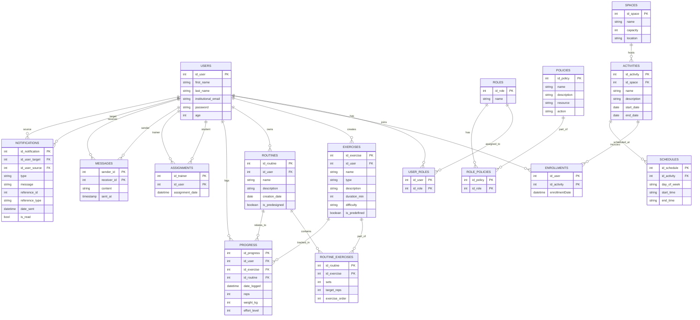

# PepitosNet - Plataforma de Bienestar Universitario Icesi

En el marco del bienestar universitario y el fomento de hábitos saludables, la Universidad Icesi busca fortalecer su oferta de espacios, actividades y programas relacionados con la actividad física. **PepitosNet** es la solución tecnológica centralizada que integra salud y comunidad para promover una vida universitaria más activa y conectada.

## Contexto del Proyecto

Actualmente, muchos estudiantes y colaboradores realizan rutinas de ejercicio en la universidad, pero carecen de una plataforma para hacer seguimiento a su progreso o conectar con entrenadores de forma eficiente. Esta aplicación web permite a los usuarios registrar sus entrenamientos, llevar el control de sus avances, recibir retroalimentación de entrenadores certificados y estar informados sobre eventos y espacios disponibles en tiempo real.

## Requerimientos del Sistema

### Funcionalidades para Usuarios
- **Autenticación:** Inicio de sesión con cuenta institucional.
- **Gestión de Rutinas:** Creación y edición de rutinas personalizadas o basadas en ejercicios predefinidos.
- **Seguimiento de Progreso:** Registro diario/semanal de métricas (repeticiones, tiempo, nivel de esfuerzo).
- **Historial y Estadísticas:** Consulta de actividades pasadas, métricas de rendimiento y gráficos de progreso.
- **Reportes:** Descarga de reportes personales de progreso en formato PDF.

### Funcionalidades para Entrenadores
- **Monitoreo:** Visualización de rutinas y progreso de los usuarios asignados.
- **Retroalimentación:** Generación de recomendaciones personalizadas según el avance.
- **Contenido:** Carga de rutinas prediseñadas para consulta pública.
- **Comunicación:** Envío de mensajes o alertas instantáneas a los usuarios asignados.

### Administración y Gestión
- **Panel Administrativo:** Gestión de entrenadores, asignación de usuarios y administración de la base de datos de ejercicios y eventos.
- **Eventos y Espacios:** Sección de horarios del gimnasio, clases (yoga, torneos) y disponibilidad en tiempo real.
- **Seguridad:** Control de acceso basado en roles (Usuario, Entrenador, Administrador).

### Características Técnicas Avanzadas
- **Notificaciones Real-time:** Uso de **WebSockets** para alertas instantáneas sobre nuevos eventos o mensajes.
- **Interfaz Responsiva:** Diseño adaptado a escritorio y dispositivos móviles.

## Diagrama de Base de Datos (Mermaid)



## Guía de Ejecución

Siga estos comandos para compilar, probar y ejecutar el proyecto:

### 1. Ejecutar Pruebas Unitarias e Integración
Para validar la lógica de negocio y generar reportes de cobertura (JaCoCo):
```bash
mvn test
```

### 2. Limpiar y Empaquetar
Para generar el archivo de despliegue (`.war` o `.jar`):
```bash
mvn clean package
```

### 3. Iniciar la Aplicación
Para ejecutar el servidor de desarrollo de Spring Boot:
```bash
mvn spring-boot:run
```

### 4. Usuarios de prueba disponibles 

El usuario que cuenta con todos los permisos es el usuario:

- Correo: admin@icesi.edu.co
- Contraseña: adminpass


Para validar que el sistema maneja bien el acceso en base a autoridades, se puede usar el usuario:

- Correo: juan.perez@icesi.edu.co
- Contraseña: pass123


La aplicación estará disponible por defecto en: `http://10.147.17.110:8080/proyectoFinal` accesible mediante Zerotier.
En la red IASLAB conectarse a `http://192.168.131.110:8080/proyectoFinal`

## Tecnologías Utilizadas
- **Backend:** Spring Boot 3.x, Spring Security, Spring Data JPA.
- **Frontend:** Thymeleaf, CSS responsivo.
- **Mensajería:** Spring WebSocket (STOMP).
- **Base de Datos:** PostgreSQL / H2.
- **Reportes:** Librerías para generación de PDF.
